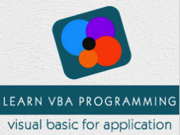

```
Roberto Nogueira  
BSd EE, MSd CE
Solution Integrator Experienced - Certified by Ericsson
```
# Tutorialspoint VBA Tutorial



**About This Tutorial**

This is to grasp rapidly the language and its concepts.

[VBA Tutorial](https://www.tutorialspoint.com/vba/index.htm)

#### Topics
```
VBA Tutorial
[ ] Home
[ ] Overview
[ ] Excel Macros
[ ] Excel Terms
[ ] Macro Comments
[ ] Message Box
[ ] Input Box
[ ] Variables
[ ] Constants
[ ] Operators
[ ] Decisions
[ ] Loops
[ ] Strings
[ ] Date and Time
[ ] Arrays
[ ] Functions
[ ] SubProcedure
[ ] Events
[ ] Error Handling
[ ] Excel Objects
[ ] Text Files
[ ] Programming Charts
[ ] Userforms
VBA Useful Resources
[ ] Quick Guide
[ ] Useful Resources
[ ] Discussion
Selected Reading
[ ] Developer's Best Practices
[ ] Questions and Answers
[ ] Effective Resume Writing
[ ] HR Interview Questions
[ ] Computer Glossary
[ ] Who is Who
```

